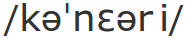

@title = 'Kanarien-Erklärung'
@nav_title = 'Canary'
@this.alias = '/canary'
@toc = false




#### _*Nomen*_

***1...*** Ein kleiner Singvogel aus der Familie der Finken, _serinus canaria domestica,_ originär heimisch auf den Inseln des Nord Atlantik.

***2...*** Ein Mechanismus, um unsichere Bedingungen zu testen, ursprünglich durch die Nutzung von Kanarienvögeln in Kohleminen, um giftige Gase oder Einstürze zu bemerken. Wenn der Kanarienvogel starb, war es Zeit, aus der Mine zu kommen. In letzter Zeit wurde der Ausdruck im Zusammenhang mit Online-Diensten genutzt, für ein regelmäßig aktualisiertes Statement, dass der Dienst nicht von Rechtsprozessen betroffen ist. Wenn der Text nicht mehr regelmäßig aktualisiert wird, können Nutzer*innen erkennen, dass der Text nicht mehr wahr sein könnte.


<pre>
<%= render :file => 'canary-statement-signed.txt', :type => :raw %>
</pre>

## Schritte zur Verifizierung

Um riseup's Schlüssel herunter zu laden und die verwendete Schlüsselbezeichnung zu verifzieren, [[solltest Du diese Schritte befolgen => network-security/certificates#complete-verification]]. Danach kannst Du mit diesen Schritten diese Erklärung überprüfen:

1. Lade das [[ canary statement => /about-us/canary/canary-statement-signed.txt]]
1. Danach führe diesen Befehl in der Kommandozeile aus:
	
	```
	gpg --auto-key-retrieve --verify canary-statement-signed.txt
	```

1. Die Ausgabe sollte so aussehen (das Datum kann entsprechend abweichen, je nachdem wann diese zuletzt unterzeichnet wurde):

	```
	gpg: Signatur vom Do 01 Feb 2018 03:35:10 CET
	gpg:                mittels RSA-Schlüssel 4E0791268F7C67EABE88F1B03043E2B7139A768E
	gpg:                Aussteller "collective@riseup.net"
	gpg: Korrekte Signatur von "Riseup Treasurer <treasurer@riseup.net>" [unbekannt]
	gpg:                     alias "Riseup Networks <collective@riseup.net>" [unbekannt]
	gpg: WARNUNG: Dieser Schlüssel trägt keine vertrauenswürdige Signatur!
	gpg:          Es gibt keinen Hinweis, daß die Signatur wirklich dem vorgeblichen Besitzer gehört.
	Haupt-Fingerabdruck  = 4E07 9126 8F7C 67EA BE88  F1B0 3043 E2B7 139A 768E
	```

Stelle sicher, dass es die Aussage "Good signature" enthält und bestätige, dass die Schlüsselbezeichnung mit der [[vorher verifizierten => network-security/certificates#complete-verification]] übereinstimmt. Wenn der Text verändert wurde, ist die Information in der Erklärung nicht vertrauenswürdig.
