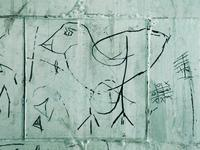
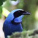
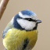
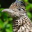
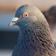
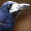
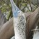
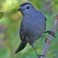
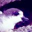

@title = 'À Propos'

## Pourquoi Riseup est nécessaire

Pouvez-vous compter sur un fournisseur commercial de courrier électronique pour la confidentialité de vos communications sensibles ? Non seulement ils parcourent et enregistrent typiquement le contenu de vos messages pour une large variété d'objectifs, mais ils concèdent aussi aux demandes des gouvernements qui limitent la liberté numérique, et échouent de fait à avoir des politiques strictes quant à la vie privée de leurs utilisateurs. Sans même les mentionner, leurs intérêts évidemment commerciaux sont en opposition avec ce que nous faisons. Les gouvernements américains pratiquent le "full pipe monitoring", soit la surveillance généralisée d'une banque d'IPs, et la cartographie des associations, ce qui leur donne la capacité de construire une carte détaillée de l'organisation de nos mouvements sociaux. Encore pire, ceci leur donne des informations précises sur les liens qui devraient être perturbés pour fragiliser la mise en place de grands mouvements sociaux.

Nous croyons qu'il est essentiel que l'infrastructure de communication soit contrôlée par des organisations des mouvements sociaux et non pas par des sociétés commerciales ou le(s) gouvernement(s).

Nous nous efforçons de garder vos mails aussi sécurisés et privés que nous le pouvons. Nous n'enregistrons pas votre adresse IP. (La plupart des services gardent les journaux détaillés de chaque machine qui se connecte aux serveurs. Nous gardons seulement les informations qui ne peuvent pas être utilisées pour identifier votre machine). Toutes vos données, y compris votre courrier, sont stockées par riseup.net de manière chiffrée. Nous travaillons dur pour garder nos serveurs sécurisés et bien défendus contre n'importe quelle attaque malveillante. Nous ne partageons aucune des données de nos utilisatrices et utilisateurs, avec personne. Nous nous battrons activement avec n'importe quelle tentative pour citer ou pour acquérir autrement n'importe quelles informations ou registres d'activité. Nous ne lirons pas, ne fouillerons, ou ne traiterons aucun de vos courriers entrant ou sortant, autrement que de manière automatique pour vous protéger des virus et des spams, ou lorsque vous nous le demanderez pour régler un problème.

## Les buts de Riseup

Le collectif Riseup est un organisme autonome basé à Seattle avec des membres dans le monde entier. Notre but est d'aider à la création d'une société libre, un monde avec l'insouciance et la liberté d'expression, un monde sans oppression ou hiérarchie, où le pouvoir est partagé de manière égalitaire. Nous réalisons ceci en fournissant la communication et des ressources informatiques aux alliéEs engagéEs dans les luttes contre le capitalisme et les autres formes d'oppression.

Nous valorisons, soutenons et nous engageons dans des luttes pour la libération humaine, le traitement éthique des animaux et la durabilité écologique. Nous joignons le combat pour la liberté et l'autodétermination de tous les groupes opprimés. Nous nous opposons à toutes les formes de préjugé, d'autoritarisme et d'avant-gardisme.

Nous nous organisons sur la base de l'autonomie, l'aide mutuelle, le partage de ressources, la connaissance participative, le plaidoyer social, le travail contre les oppressions, la création communautaire et la sécurisation des communications.

Nous travaillons à créer la révolution et une société libre dans le présent en construisant l'infrastructure de communication alternative conçue pour nous opposer et remplacer le système dominant.

Nous promouvons la propriété collective et le contrôle démocratique des informations, des idées, de la technologie et des moyens de communication.

Nous encourageons les organisations et individuEs à utiliser la technologie dans les luttes pour leur libération. Nous travaillons pour soutenir chacunE à surmonter l'oppression systémique incorporée dans l'utilisation et le développement des technologies.

## Découvrez le collectif

<strong>Geai à collier (Cyanolyca armillata)</strong> 
Le geai à collier a passé la majeure partie de sa vie à documenter la nouvelle génération d'activistes de terrain dans l'amérique du sud occidentale. Il aime apprendre de nouvelles choses, y compris dans le domaine de l'informatique, c'est pourquoi il est en mesure de contribuer au travail technologique de riseup. Le geai est connu pour être un oiseau ami des lapins, sceptique quant aux tendances en matière de conception mobile et pour ne pas aimer écrire les noms en majuscule. Il évite les technologies utilisant des noms de bijoux.

<strong>Jaseur d'Amérique (Bombycilla cedrorum)</strong> 
Le jaseur d'Amérique est un hacker révolutionnaire et critique du capitalisme tardif. Bien que profondément sceptique à l'égard de la technologie, le jaseur a passé une grande partie de sa vie à tenter, de manière idéaliste, de mettre la technologie au service de la libération. Lorsqu'il n'est pas en train de pianoter sur son clavier, le jaseur se nourrit de baies de genièvre, effectue de long vols [-randonnées-] et joue avec ses adorables petits.

<strong>Colibri Jacobin (Florisuga mellivora)</strong> 
Originaire des quartiers les plus dangereux de Santiago de Chile, le colibri jacobin a quitté sa ville natale pour vivre une vie sans adresse. Une bande bleu clair traverse ses plumes bien entretenues et si elle se consacre à la lecture et à l'écriture dans une tranquillité absolue, elle n'hésite pas à utiliser ses capacités et son esprit radical pour lutter contre les riches, les hommes, les mangeurs de viande, les fascistes, la monogamie, et la police. Vous la trouverez sur Riseup en train de former des alliances avec d'autres organisations et défendre avec éloquence l'idée qu'une infrastructure autonome est la seule chose qui nous sauvera de cet internet néolibéral et hyper-surveillé dans lequel nous habitons.

<strong>Mésange bleue (Cyanistes caeruleus)</strong> 
La mésange bleue est facilement reconnaissable à son plumage bleu, mais diverses autorités contestent sa classification scientifique. Pendant ses études, elle a parcouru l'Europe pour contrer les sommets, les forums sociaux et autres. Après l'université, elle a cherché un perchoir commun dans le web. Elle a donc commencé à travailler sur we.riseup.net. Il y a quelques années, elle a cessé de migrer et niche désormais dans une petite commune.

<strong>Grand Géocoucou (Geococcyx californianus)</strong> 
Le grand géocoucou est un oiseau de la famille des coucous, à longues pattes et cherchant sa nourriture au sol. Originaire du sud-ouest de l'Amérique du Nord, ce spécimen apprécie actuellement d'être hors du désert et de s'imprégner de l'humidité de la Cascadia. Il passe ses journées en tant que hacker anarchiste, développeur de Debian, et papa. Au siège de Riseup, il est de notoriété publique que le géocoucou est un monstre concernant le matériel informatique.

<strong>Pigeon biset (Columba livia)</strong> 
La pigeonne s'est tenue à l'écart du collectif Riseup depuis le début, et a finalement rejoint Riseup il y a quelques années. Elle n'est pas une geek, mais trouve cela étrangement fascinant. Lorsqu'elle ne travaille pas sur la lettre d'information ou n'approuve pas des listes et emails, elle est travailleuse sociale, une écrivaine de science-fiction pour jeunes adultes, et une passionnée de communauté égalitaire. Elle pense que l'avenir n'est pas écrit, et que c'est chaque jour que nous écrivons le livre.

<strong>Corbeau freux (Corvus frugilegus)</strong> 
Le corbeau freux se tient dans un coin, et travaille sur une solide défense. Bien que la maison du corbeau freux soit [[l'Eurasie => https://fr.wikipedia.org/wiki/Corbeau_freux#R%C3%A9partition]], le corbeau freux a principalement vécu dans le nord-ouest du Pacifique, même s'il y a eu plusieurs périodes de travail à domicile. Le corbeau aide à fabriquer des outils que d'autres oiseaux utilisent pour pirater les intersections de la kyriarchie, du [["cissexisme" => https://fr.wikipedia.org/wiki/Cissexisme]] et l'hétérosexisme au racisme, dans le monde en général et au sein du mouvement pour la justice sociale lui-même. La [[voix => https://fr.wikipedia.org/wiki/Corbeau_freux#Le_croassement]] du corbeau semble souvent dure pour beaucoup, c'est pourquoi il s'exprime peu. Le corbeau freux aime manger des légumes frais, il en cultive donc beaucoup.

<strong>Harfang des neiges (Bubo scandiacus)</strong> 
Le harfang des neiges est perché sur une branche glacée, regardant de loin l'intérieur des machines Riseup pour trouver de petits bogues à grignoter. Il a participé à la création de Riseup lorsqu'il vivait à Seattle, parce qu'il a été consterné par tous les activistes qui se sont présentés pour interrompre la conférence de l'OMC, avec leurs comptes hotmail et yahoo. Il travaille dur pour garder les serveurs de Riseup en marche, le réseau rapide, et empêcher les pourriels de polluer votre boîte de réception. Ses autres activités comprennent la lecture et l'écriture de livres, et le gain de prix étranges et déroutants. Il a participé à la mise en place de l'infrastructure technique d'Indymedia, et contribue actuellement en maintenant quelques petites parties. Le harfang des neiges est aussi l'une des personnes les plus sympathiques de la planète.

<strong>Souimanga asiatique (Nectarinia asiatica)</strong> 
Le souimanga a élu domicile dans le nord-ouest du Pacifique depuis 1998, mais s'est absenté des États-Unis pendant deux ans, vivant à l'étranger à Lahore, au Pakistan, où il a étudié l'ourdou et travaillé bénévolement pour la Commission des droits humains. Pour son travail de jour, il est juriste et se consacre à la protection des droits des immigrés et des réfugiés. Le souimanga s'intéresse également de près au droit de l'internet dans la mesure où il est lié à la vie privée et à la liberté d'expression. Il a rejoint le collectif Riseup parce qu'il est essentiel pour les militants de disposer d'outils de communication dignes de confiance. Vous pouvez trouver le souimanga sur IRC, répondant à vos tickets d'assistance, s'efforçant d'apprendre Debian et rêvant d'un avenir sans AOL. L'ID de la clé gpg du souimanga est @0xD45523676ED610B7@, disponible sur votre serveur de clés local.

## Anciens

<strong>Ara rouge (Ara macao)</strong> 
L'ara rouge est un jeune geek originaire d'Amérique du Sud. Il s'intéresse aux maths appliquées, à la théorie informatique, à la programmation, aux logiciels libre et au piratage en général, ainsi qu'à la collaboration, aux communautés virtuelles et réelles autogérées, à la politique, à l'économie, aux mouvements sociaux, à la théorie anarchiste et comment diable nous allons sortir le monde de ce trou à rats dans lequel on se trouve actuellement.

<strong>Fou à pieds bleus (Sula nebouxii)</strong> 
Le fou à pieds bleus adore les aliments fermentés et les films d'action anarchistes allemands. Ces dernières années, il a appris les statistiques appliquées dans les petites rues de Seattle, et à présent il fait des calculs importants pour déterminer précisément quand les serveurs de liste riseup vont exploser.

<strong>Moqueur chat (Dumetella carolinensis, petit oiseau des buissons)</strong> 
Le moqueur chat se perche derrière les feuillages, chantant toute la journée. Le moqueur chat aime chanter pour les serveurs GNU/Linux, le plus souvent en Perl ou Ruby. Le moqueur chat aime remettre en question les stéréotypes de genre et n'a pas peut d'intégrer l'énergie féminine dans le travail technique.

<strong>Pétrel (Pterodroma)</strong> 
La pétrelle travaille à la mise en place de politiques et de systèmes de communication basés sur les besoins humains et non sur les profits des entreprises. Elle pense qu'il n'y pas de solution technique mais que cette technologie peut être utile si elle est utilisée de façon modérée. Bien qu'il s'agisse d'une oiselle marine, elle a migré vers l'intérieur des terres pour étudier et enseigner le journalisme et la communication, avec l'espoir d'inspirer de nouvelles générations de pétrels. Ses autres centres d'intérêt sont la vie en colocation, le jardinage urbain et Captain Beefheart. Elle croit aussi fermement à l'entraide et adore les blagues sur les pirates.

<strong>Étourneau sansonnet (Sturnus Vulgaris)</strong> 
L'étourneau sansonnet est un oiseau migrateur avec des étoiles sur ses ailes et un cri de révolte. Il travaille au développement du logiciel Riseup et veille à ce que les personnes soient responsables et respectent les tâches à accomplir. L'étourneau s'intéresse à la mise en place d'une infrastructure de mouvement, des tactiques, et des stratégies pour le long terme. L'étourneau est aussi à l'aise pour arracher les globes oculaires des crânes que pour déféquer en hauteur.

<strong>Macareux huppé (Fratercula cirrhata)</strong> 
La macareuse huppée est un oiseau marin de taille moyenne et un membre du collectif Riseup. Elle niche à Seattle, ce qui est plutôt loin pour une macareuse. La macareuse huppée passe une grande partie de son temps devant un ordinateur, utilisant des interfaces tapes-à-l’œil comme pine, mais elle aime aussi aller dehors. Elle se déplace à vélo ou en nageant grâce à des ailes qui se sont adaptées pour lui permettre de voler sous l'eau. La macareuse huppée apprécie acquérir des compétences techniques grâce à Riseup et à d'autres projets technologiques radicaux et, plus important encore, contribuer à la mise en place d'infrastructures alternatives.

