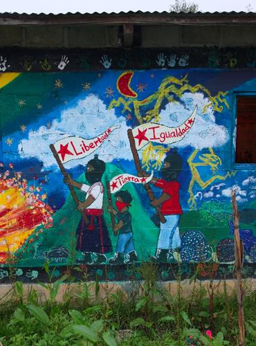

@title = 'Principes politiques'

Le but de notre organisation est la création d'une société libre, organisée selon les principes suivants :

**Démocratie** --Une société libre dépend de médias indépendants et d'une organisation civile, sociale et économique basée sur une démocratique participative qui découle directement des actions et de la responsabilisation des gens. Ainsi, ceux et celles qui sont affecté-e-s par une décision ont l'opportunité-e de participer à la prise de cette décision.

**Égalité** --Tout le monde fait partie de la société. Tous et toutes sont égaux et tout travail a une valeur égale.

**Diversité** --Tout le monde est différent et les milieux nécessaires à ces différences sont primordiales pour la préservation de l'équité.

**Sécurité** --Tout être humain dans une société libre à le droit à un accès sécuritaire aux différentes ressources nécessaires à combler ses besoins de bases en matière d'alimentation, de logement, de santé, d'information et de transport.

**Créativité** --Une société libre considère la culture, l'art et les loisirs comme des besoins fondamentaux. Tout le monde a le droit à sa propre culture et de s'exprimer de façon créative.

**Autodétermination** --Une société libre est décentralisée et toute les localités sont autonomes et s'autodéterminent tant et aussi longtemps qu'elles ne portent pas atteinte aux autres principes de base d'une société libre.

**Interdépendance** --Les communautés d'une société libre dépendent les unes des autres dans une optique d'aide et d'échange mutuel.

**Justice** --Tout le monde à le droit de ne pas subir de mesures coercitives, de ne pas recevoir de menace et de ne pas être victime de violence. Un système judiciaire devrait uniquement affecter la communauté où il se trouve, chercher des solutions au lieu d'essayer de se venger et il devrait travailler pour l'abolition des prisons autoritaire.

**Paix** --Une société libre se sert des conflits comme d'une opportunité pour apprendre de divers points de vue, opinions et expériences dans le but de créer des accords et de prendre des actions qui respectent les droits fondamentaux des différents partis.

**Écologie** --Les humains font parti de la nature, mais ils doivent aussi vivre en équilibre avec cette dernière. Une société libre reconnaît le droit à de l'eau propre, de l'air propre et de la nourriture sans toxine et organismes génétiquement modifiés.

**Économie** --Dans une société libre, les moyens de productions devraient appartenir aux gens dans le but d'organiser des milieux de travail valorisant et d'offrir un standard de vie minimal permettant à tous et toutes de combler leurs besoins.
