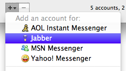
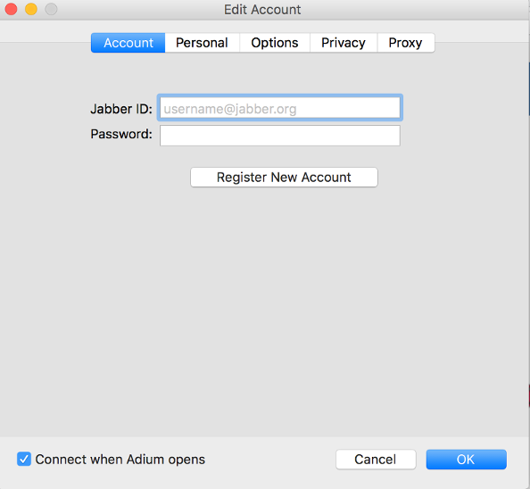
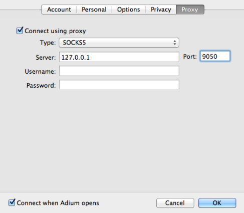

@title = 'Adium'

## À propos Adium

Adium est le client XMPP recommandé pour OSX. Il est libre et open source en plus de supporter [[OTR]] pour l'encryption bout-à-bout des messages.

Vous pouvez télécharger Adium à l'adresse suivante : https://adium.im

## Configurer un compte

(1) menu `Adium` > entrée `Preferences...` > onglet `Accounts`

(2) Cliquez sur l'icône plus dans le coin inférieur gauche et sélectionnez `XMPP`.

(3) Dans l'onglet `Accounts`, entrez votre email riseup et votre mot de passe.

(4) Dans l'onglet `Options`:

- Dans `file transfer proxy` mettez l'adresse suivante: `proxy.riseup.net`.
- Cochez la case `Require SSL/TLS`.

(5) Cliquez sur `OK`

## Pour utiliser OTR

Additionnellement, vous pourriez vouloir activer [[OTR]]. << insert OTR tutorial here >>

## Pour utilizer Tor

(1) menu `Adium` > entrée `Preferences...` > onglet `Accounts`

Éditez la configuration du compte que vous voulez configurer pour utiliser Tor. Sélectionnez l'onglet `Proxy` et configurez le de la façon suivante :

