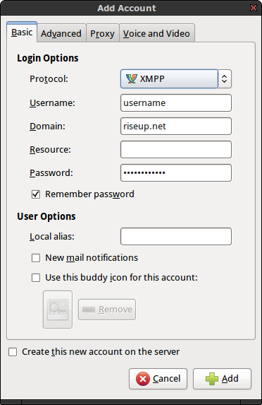
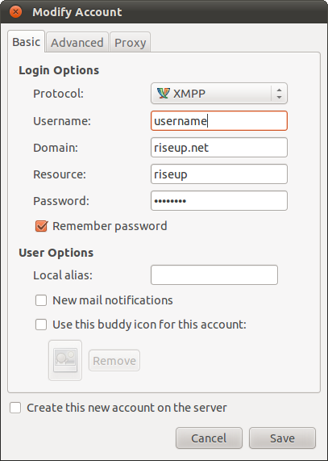
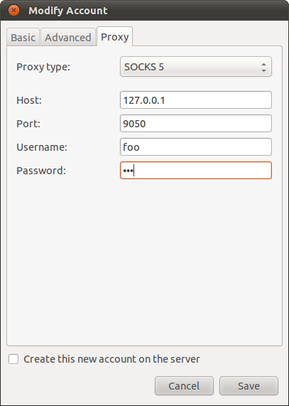

@title = 'Pidgin'

## About Pidgin

Pidgin is the most popular instant message client for GNU/Linux, Windows, and macOS. You can download Pidgin here https://pidgin.im/download. For Mac, check out [[Adium]], the native build of Pidgin for Mac.

## Setting up an account

When you first start Pidgin, click the `Add...` button to add an account.

(1) In the tab `Basic`, set these values:

- `Protocol`: XMPP
- `Username`: your Riseup username
- `Domain`: riseup.net
- `Password`: your [[riseup-password]]

Optionally, set the local alias as your name, optionally choose an icon for yourself. Other people will see this in their buddy list and when you message with them.

## Using OTR

See the [[otr]] tutorial for details on using end-to-end encryption with Pidgin.

## Securing pidgin on GNU/Linux with ["AppArmor"](https://gitlab.com/apparmor/apparmor/wikis/home/)

For added security on Linux systems, we recommend you secure your pidgin following these steps:

- copy usr.bin.pidgin to `/etc/apparmor.d/usr.bin.pidgin`
  * [usr.bin.pidgin for Ubuntu 14.04](https://bazaar.launchpad.net/~apparmor-dev/apparmor-profiles/master/view/head:/ubuntu/14.04/usr.bin.pidgin)
- restart apparmor
`sudo /etc/init.d/apparmor restart`
- restart pidgin

## Tor with Pidgin configuration

For configuring Pidgin to use Tor, you need to modify your account settings as follows:

First chose `Modify Account Settings`...

Then click the `Advanced` tab and set these values:

- `Connection Security`: Require encryption
- `Connect Port`: 5222
- `Connect Server`: at [[Riseups list of .onion services->tor#riseups-tor-hidden-services]] look for `xmpp.*.onion`
- `File Transfer Proxies`: proxy.riseup.net

Then click on the `Proxy` tab...

Set the `proxy type` as `Socks5`, set the host and port as shown in the image, and set your username and password.
