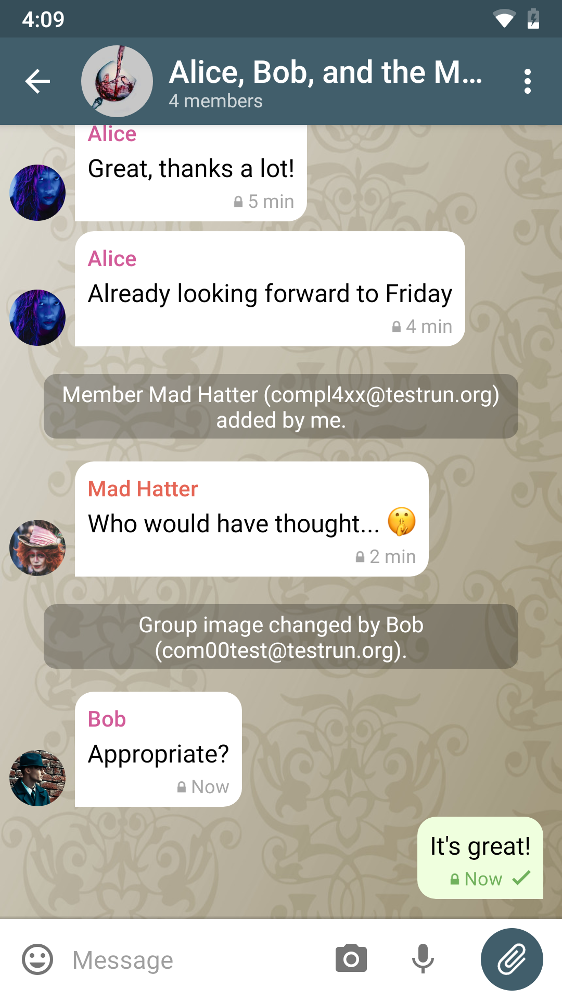
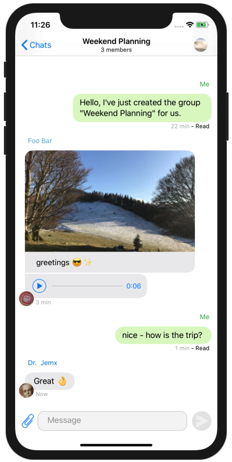

@title = 'Delta Chat'

 

[Delta Chat](https://delta.chat) ist ein dezentraler Open-Source-Messenger. Im Gegensatz zu anderen Messengern braucht ihr keinen extra-Account, ihr könnt euch einfach mit eurer E-Mail-Adresse einloggen. Ihr könnt auch nicht nur mit anderen Delta Chat-Nutzer/innen schreiben - alle anderen Leute empfangen eure Nachrichten einfach als E-Mails.

Für die Ende-zu-Ende-Verschlüsselung benutzt Delta Chat openPGP, der [Autocrypt-Standard](https://autocrypt.org) macht es aber leicht zu bedienen.  Nach dem Austausch der ersten Nachricht sind alle Nachrichten verschlüsselt.

Mit anderen Delta Chat-Nutzer/innen wird der Chat verschlüsselt, aber auch mit Nutzer/innen von anderen [Autocrypt-Clients](https://autocrypt.org/install.html) wie Thunderbird mit Enigmail.

Delta Chat gibt es kostenlos für Android, Linux, Windows, MacOs, und iOS. Auf der [offiziellen Website](https://get.delta.chat) findet ihr heraus, wie ihr es auf euren Geräten installiert.

 
 

 

 

