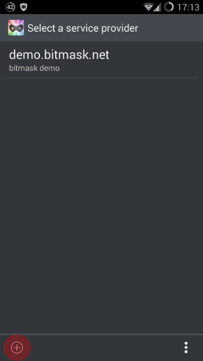
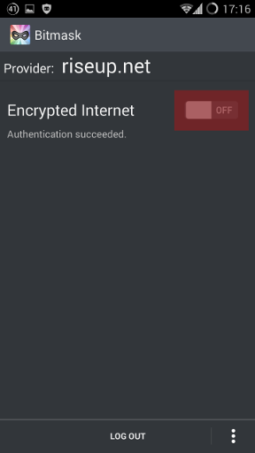
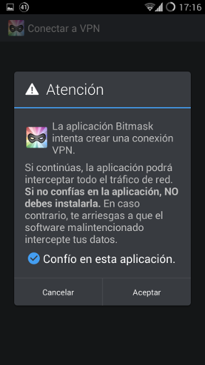

@nav_title = "Android"
@title = "Anleitung: Android"
@summary = "Bitmask für Android: Herunterladen, Installation und Konfiguration"

## Bitmask herunterladen und installieren

Es gibt zwei Wege, die Bitmask-Anwendung zu bekommen, eine ist sie direkt herunter zu laden von der [Bitmask-Webseite](https://dl.bitmask.net) und die zweite ist über den Play Store.

Die erste bedeutet, manuell alle Aktualisierungen laden zu müssen. Die zweite, dass Google live auf dem Gerät installiert sein muss. Im Moment empfehlen wir den direkten Download.

### Bitmask für Android herunterladen und installieren

Die aktuelle Version von Bitmask für Android gibt es unter dieser URL [https://dl.bitmask.net/client/android/Bitmask-Android-latest.apk](https://dl.bitmask.net/client/android/Bitmask-Android-latest.apk) oder lies den folgenden QR-Code mit deinem Gerät:

Zum installieren markiere the Option "unbekannte Quellen" in den Einstellungen von Android -> Sicherheit -> "Unbekannte Quellen". Dies erlaubt die Installation von Anwendungen jenseits des Play Store.

### Laden von Bitmask über den Play Store

Suche nach Bitmask im Play Store, oder besuche die folgede URL mit deinem Gerät [https://play.google.com/store/apps/details?id=se.leap.bitmaskclient](https://play.google.com/store/apps/details?id=se.leap.bitmaskclient) oder lies den folgenden QR-Code mit deinem Gerät:

## Bitmask beim ersten Start

Zuerst brauchst du ein LEAP (black) Riseup-Konto. Dazu gehe auf [https://black.riseup.net/login](https://black.riseup.net/login) und registriere ein neues Konto. Dies ist ein neues System, also funktioniert dein Riseup-Konto dort nicht.

Danach öffne die Bitmask-Anwendung.

### Bitmask mit riseup.net als Anbieten konfigurieren

Nach dem ersten Start wird eine Liste von Anbietern angezeigt. Unten links siehst du ein + Symbol in einem Kreis. Drück darauf.

Schreibe "riseup.net" als Anbieter.

Danach validiert Bitmask riseup.net als sicherer LEAP-Anbieter, drücke login.

Fülle die Info mit deinem LEAP (black) Riseup-Konto.

Aktiviere die Riseup EIP durch Klopfen auf den Schalter.

Android fragt dich, ob Bitmasj eine VPN-Verbindung aufbauen soll. Markiere 'Ich vertraue dieser Anwendung' und dann *accept*.

Sobald der Schalter an ist, benutzt du das Verschlüsselte Internet von Riseup. Yay!
