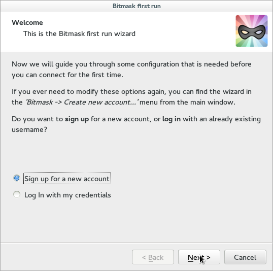
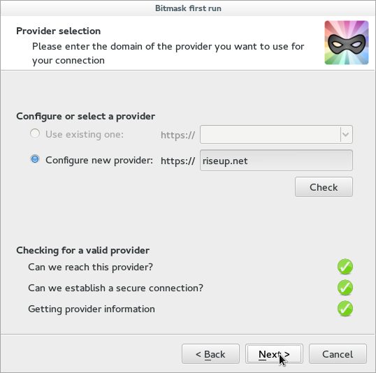
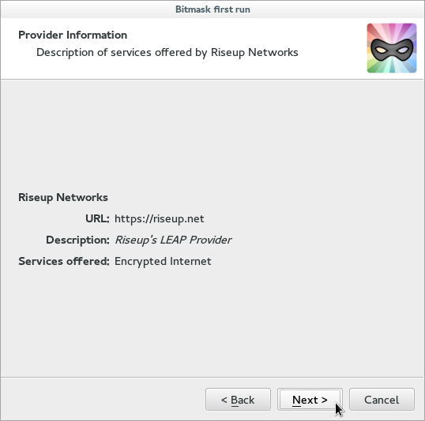
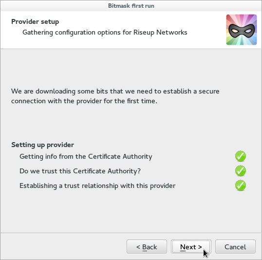
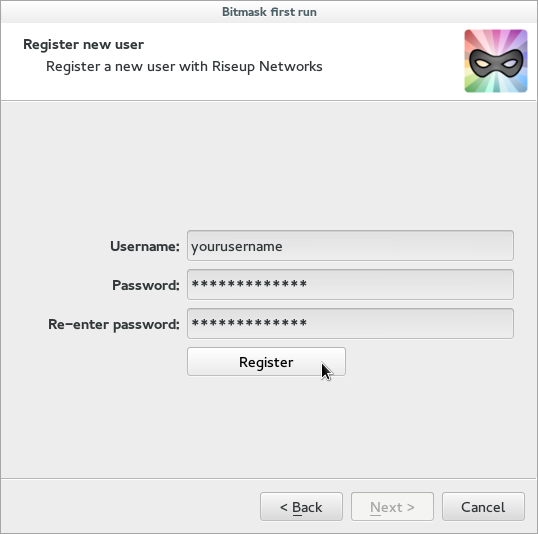
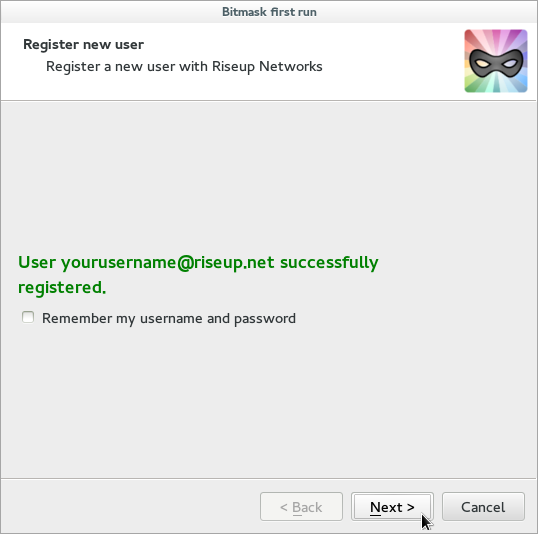
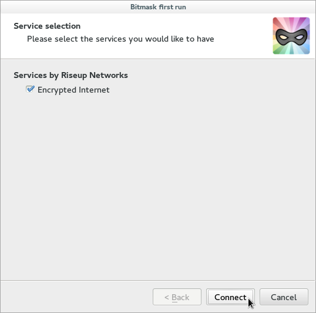

@nav_title = "GNU/Linux"
@title = "Anleitung: GNU/Linux"
@summary = "Bitmask für Linux: Herunterladen, Installation and Konfiguration"

Um Riseups VPN-Dienst zu benutzen, brauchst du ein LEAP-Konto. Dieses kann direkt mit Bitmask (die LEAP-Anwendung) erstellt werden, oder von [https://black.riseup.net/signup](https://black.riseup.net/signup). **Es wird empfholen, das neue Konto direkt mit Bitmask zu erstellen, es sei denn, Du hast vor, das VPN nur von Android aus zu benutzen**.

## Bitmask herunterladen und installieren

Die Bitmask Anwendung für GNU/Linux kann auf zwei Arten bezogen werden. Wenn du [Ubuntu](#ubuntu) oder [Debian](#debian) benutzt, dann kannst du die Bitmask Paketquellen hinzufügen um deine Version aktuell zu halten. Alternativ kannst du Dir das [stand-alone bundle](#stand-alone-bundle) herunterladen, welches sich von externen Medien wie z.B. USB-Sticks ausführen lässt. Dazu ist anzumerken, dass das stand-alone bundle langsamer ist, mehr Platz in Anspruch nimmt und schlechter in den Desktop integriert ist als das Ubuntu/Debian Paket - ausserdem musst du die Aktualisierungen manuell durchführen.

**Wir empfehlen die Paketversion für Ubuntu/Debian**. Falls dieses für Deine Distribution nicht funktioniert, solltest Du das Einzelpaket nutzen.

### Ubuntu

Unten aufgeführte Schritte beschreiben wie du die Bitmask Paketquellen zu deinem System hinzufügst. Diese Kommandos müssen - einer nach dem anderen - in einem Terminal ausgeführt werden. Du wirst dabei nach deinem sudo (super user do) Passwort gefragt. Die Informationen über das Archiv werden in `/etc/apt/sources.list.d/bitmask.list` gespeichert.

#### Installation für Trusty Thar (14.04)

        echo "deb http://deb.bitmask.net/debian trusty main" | sudo tee -a /etc/apt/sources.list.d/bitmask.list
        curl https://dl.bitmask.net/apt.key | sudo apt-key add -
        sudo apt-get update
        sudo apt-get install bitmask leap-keyring

#### Deinstallation

        sudo apt-get remove bitmask leap-keyring
        sudo apt-key del 0x1E34A1828E207901
        sudo rm /etc/apt/sources.list.d/bitmask.list
        sudo apt-get update

### Debian

Unten aufgeführte Schritte beschreiben wie du die Bitmask Paketquellen zu deinem System hinzufügst. Diese Kommandos müssen - einer nach dem anderen - in einem Terminal ausgeführt werden. Du wirst dabei nach deinem sudo (super user do) Passwort gefragt. Die Informationen über das Archiv werden in `/etc/apt/sources.list.d/bitmask.list` gespeichert.

#### Installation für Wheezy (Debian 7)

Du musst `wheezy-backports` bei den Paketquellen aktivieren.

        echo "deb http://deb.bitmask.net/debian wheezy main" | sudo tee -a /etc/apt/sources.list.d/bitmask.list
        curl https://dl.bitmask.net/apt.key | sudo apt-key add -
        sudo apt-get update
        sudo apt-get install bitmask leap-keyring

#### Installation für Jessie (Debian 8)

        echo "deb http://deb.bitmask.net/debian jessie main" | sudo tee -a /etc/apt/sources.list.d/bitmask.list
        curl https://dl.bitmask.net/apt.key | sudo apt-key add -
        sudo apt-get update
        sudo apt-get install bitmask leap-keyring

#### Installation für Jessie über das Tor-Anonymisierungsnetzwerk:

        sudo apt-get install apt-transport-tor
        echo "deb tor://deb.bitmask.net/debian jessie main" | sudo tee -a /etc/apt/sources.list.d/bitmask.list
        curl https://dl.bitmask.net/apt.key | sudo apt-key add -
        sudo apt-get update
        sudo apt-get install bitmask leap-keyring

#### Deinstallation

        sudo apt-get remove bitmask leap-keyring
        sudo apt-key del 0x1E34A1828E207901
        sudo rm /etc/apt/sources.list.d/bitmask.list
        sudo apt-get update

### Einzelanwendung

Die stand-alone Version von dem Bitmask Paket sollte auf allen Debian basierenden GNU/Linux Distributionen funktionieren (Mint, Ubuntu, Elementary etc.) Denk daran, dass DU für das Aktualisieren der Software verantwortlich bist.

Um die Einzelanwendung herunter zu laden, musst du den Typ deines Kernels (dem Betriebssystemkern) wissen. Das lässt sich mit `uname -m` herausfinden.

#### 64bit

Wenn die Ausgabe dieses Befehls 'x86_64' oder 'amd64' ist, dann ist die aktuellste Version hier erhältlich [https://dl.bitmask.net/client/linux/Bitmask-linux64-latest.tar.bz2](https://dl.bitmask.net/client/linux/Bitmask-linux64-latest.tar.bz2) und die OpenPGP-Signatur von [https://dl.bitmask.net/client/linux/Bitmask-linux64-latest.tar.bz2.asc](https://dl.bitmask.net/client/linux/Bitmask-linux64-latest.tar.bz2.asc). 

Die folgenden Befehle laden und verifzieren die Authentizitätinformationen des Pakets.

        gpg --keyserver pool.sks-keyservers.net --recv-key "1E45 3B2C E87B EE2F 7DFE 9966 1E34 A182 8E20 7901"
        curl -O https://dl.bitmask.net/client/linux/Bitmask-linux64-latest.tar.bz2
        curl -O https://dl.bitmask.net/client/linux/Bitmask-linux64-latest.tar.bz2.asc
        gpg --verify Bitmask-linux64-latest.tar.bz2.asc Bitmask-linux64-latest.tar.bz2

Wenn du 'Correct signature' oder 'Good signature' in der Ausgabe siehst, entpacke es mit folgendem Befehl:

        tar xfj https://dl.bitmask.net/client/GNU/Linux/Bitmask-GNU/Linux64-latest.tar.bz2

#### 32bits

Wenn die Ausgabe 'i686' oder 'i386' zeigt, lade die aktuellste Version von [https://dl.bitmask.net/client/Bitmask-linux32-latest.tar.bz2](https://dl.bitmask.net/client/Bitmask-linux32-latest.tar.bz2) und die OpenPGP-Signature von [https://dl.bitmask.net/client/Bitmask-linux32-latest.tar.bz2.asc](https://dl.bitmask.net/client/Bitmask-linux32-latest.tar.bz2.asc). 

Die folgenden Befehle laden und verifzieren die Authentizitätinformationen des Pakets.

        gpg --keyserver pool.sks-keyservers.net --recv-key "1E45 3B2C E87B EE2F 7DFE 9966 1E34 A182 8E20 7901"
        curl -O https://dl.bitmask.net/client/linux/Bitmask-linux32-latest.tar.bz2
        curl -O https://dl.bitmask.net/client/linux/Bitmask-linux32-latest.tar.bz2.asc
        gpg --verify Bitmask-linux32-latest.tar.bz2.asc Bitmask-linux32-latest.tar.bz2

Wenn du 'Correct signature' oder 'Good signature' in der Ausgabe siehst, entpacke es mit folgendem Befehl:

        tar xfj Bitmask-GNU/Linux32-latest.tar.bz2

## Bitmask zum ersten Mal benutzen

Beim ersten Start, kannst du Riseup LEAP als Anbieter auswählen. Diese Schritte geleiten dich durch diesen Prozess.

### Ein LEAP-Konto erstellen

Wähle 'sign up' für ein neues Konto und klicke auf *weiter*.

Wählre Configure a new provider und fülle die nötigen Felder mit 'riseup.net'. Danach drücke *check*.

Bitmask muss sicherstellen, dass riseup.net ein gültiger Anbieter ist. Danach mit *next* fortfahren. Wenn es bei diesem Schritt ein Problem gibt, siehe Problemblösung ganz unten.

Wenn alles gut läuft, wirst du diesen Bildschirm sehen, drücke danach *next*.

Bitmask muss sicherstellen, dass die Verbindung zu riseup.net sicher ist. Danach drücke *next*. Wenn bei diesem Schritt Probleme entstehen, siehe [[troubleshooting]].

Der nächste Schritt ist, Name und Passwort für dein Konto zu definieren. Bitte stelle sicher, beides nicht zu verlieren.

Es ist nicht möglich, deinen aktuellen riseup-Namen zu wählen. Damit wollen wir mögliche Probleme zwischen dem aktuellen und dem neuen System ausschließen. Aber es wird später möglich sein, den alten Namen zurück zu bekommen.

Bestätigungsnachricht. Du kannst Bitmask deine Daten speichern lassen, bitte halte selbst auch eine Kopie davon. Drücke *next* um fortzufahren!

Wähle Encrypted Internet und Connect. Wilkommen beim Riseup VPN-Dienst. Yay!

## Problemlösung

Schau auf die [[Problemlösungsseite -> troubleshooting]].
